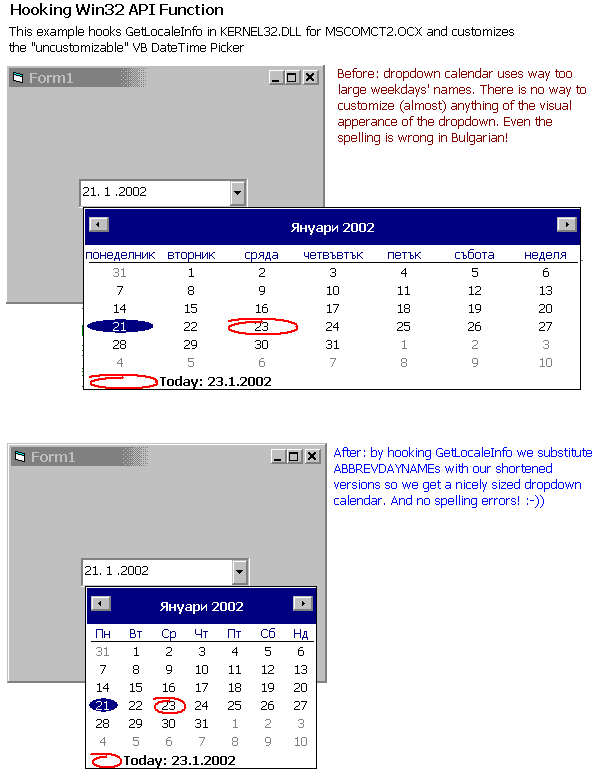



## Hook Win32 API Functions: includes a sample of customizing VB DTPicker by hooking GetLocaleInfo

### Description

This code is based on an originally code found in a MSDN's Bugslayer article written by John Robbins. Of course i had to 'just' translate it to VB which in fact turned out quite nicely and secondly had to find some usage for the such written code. Well, the problem of customizing VB DTPicker in MS Windows Common Controls 2 has bugged me for years now and viola, totally hacked GetLocaleInfo is my answer. Probably these two events happened in reverse order but nevermind;-))

Speaking of purpose, another cool thing will be to intercept DrawFrameControl api function and for instance swap the arrows of every scrollbar in your application ;-)) Now, for the serious stuff -- try as an excercise to get those arrows on the DTPicker work correctly under win 2k -- they tend to draw incorrectly when depressed, anyone else noticed this problem?

And while on the DrawFrameControl topic someone might try to fix the freaking Microsoft Windowless Controls .ocx. It has all sort of drawing problems -- most noteably scrollbars and dropdown arrows.
 
### More Info
 

             |
---                |---
**Submitted On**   |2002-01-21 19:11:46
**By**             |[Vlad Vissoultchev](https://github.com/Planet-Source-Code/PSCIndex/blob/master/ByAuthor/vlad-vissoultchev.md)
**Level**          |Advanced
**User Rating**    |4.9 (59 globes from 12 users)
**Compatibility**  |VB 6\.0
**Category**       |[Windows API Call/ Explanation](https://github.com/Planet-Source-Code/PSCIndex/blob/master/ByCategory/windows-api-call-explanation__1-39.md)
**World**          |[Visual Basic](https://github.com/Planet-Source-Code/PSCIndex/blob/master/ByWorld/visual-basic.md)
**Archive File**   |[Hook\_Win32505881232002\.zip](https://github.com/Planet-Source-Code/vlad-vissoultchev-hook-win32-api-functions-includes-a-sample-of-customizing-vb-dtpicker-by__1-31105/archive/master.zip)

